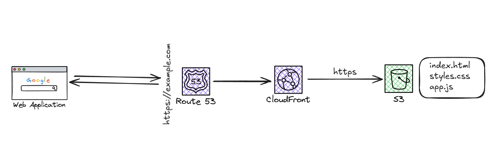

# Static website project

## Overview

This project provisions a production-style static website infrastructure on AWS using Terraform.

The goal is not only to deploy a website, but also to learn Infrastructure as Code (IaC) by building and understanding each AWS component individually.

- Amazon S3 for static content storage
- Amazon CloudFront as the Content Delivery Network (CDN)
- AWS Certificate Manager (ACM) for HTTPS
- Amazon Route 53 for DNS management

### Learning objectives
- S3
- Cloudfront
- Route 53
- AWS certificate manager
- DNS fundamentals
- HTTP certificates
- CDN concepts
- Static website hosting
- Bucket policies

